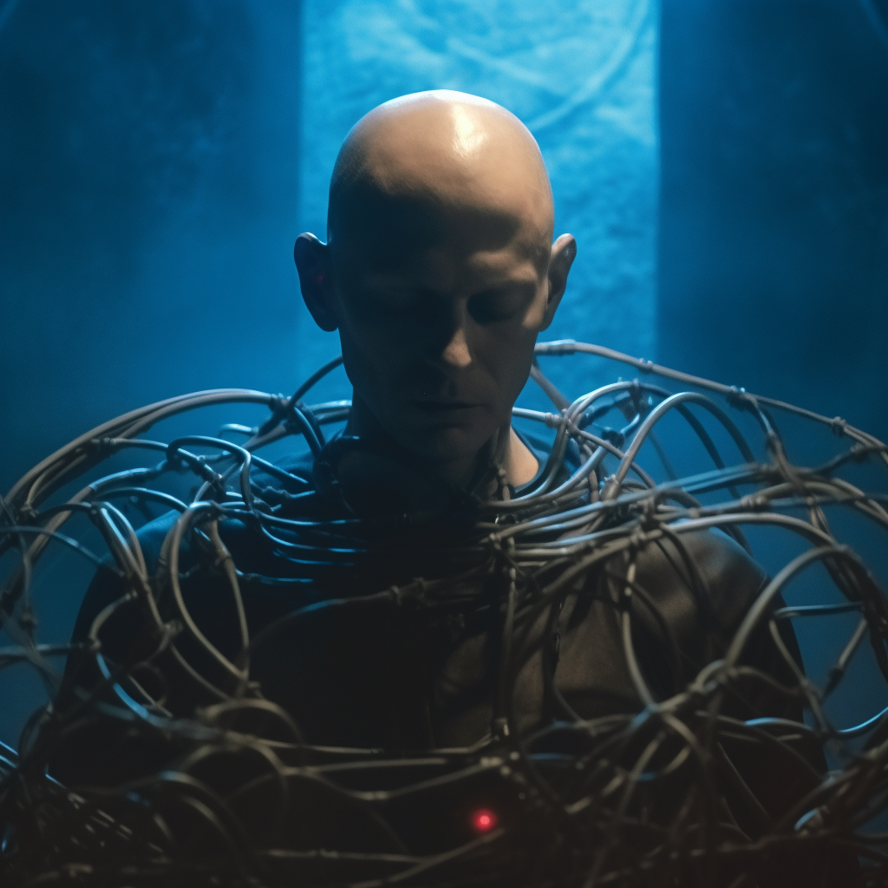

# Adam Rå — Press pack

_Dark techno_ ✶ _EBM_ ✶ _Industrial_ ✶ _Dark disco_

## Notka po polsku

Wrocławski producent i DJ. Miłośnik przytulnego mroku i pesymista. Adam tworzy zarówno atmosferyczne, tajemnicze dark techno, jak zwarte i neurotyczne techno-EBM. Wydaje m.in. w Sharped Records (Lyon) i Rawsery Records (Londyn). 
Nie stroni od współpracy z wokalistami, działa aktywnie w duecie Uncarnate (darkwave, electro-pop), który występował m.in. na scenie festiwalu Castle Party.
Jako DJ bardziej ceni sobie kreatywność i nowe możliwości stworzone przez AI niż tradycyjny warsztat. Widziano go za konsoletą we wrocławskim klubie Ciało, na Wyspie Tamce oraz w kilku krakowskich klubach. Występował też dwukrotnie na niezależnym mini-festiwalu Rejvasummer w Gnieźnie. Zapraszany dwukrotnie do nagrania podcastów (Dark Disco i Horror Show). 

## Bio in English

Adam Rå, or Adam Radziszewski, a producer and DJ, an AI researcher and a pessimist. Adam specializes in melodic dark techno and punchy neurotic EBM. In 2024 he joined the ranks of Sharped Records (Lyon) and Rawsery Records (London). As an active DJ, Adam likes to capitalise on the new opportunities created by modern technologies such as stem separation rather sticking to the tradition. He's performed in several Polish clubs and a festival. He's been invited to record podcasts twice, delivering consistent stories built from diverse means.
Also known as half of Uncarnate (darkwave / electro-pop duo) which played numerous gigs in various venues including the Castle Party Festival.

## Links

Soundcloud: [soundcloud.com/adam_ra](https://soundcloud.com/adam_ra)

Instagram: [instagram.com/adam.xra](https://www.instagram.com/adam.xra/)

Bandcamp: [adamra.bandcamp.com](http://adamra.bandcamp.com/)

On Sharped Records: [sharpedrecords.bandcamp.com/album/incompatible-with-life](https://sharpedrecords.bandcamp.com/album/incompatible-with-life)

Spotify: [open.spotify.com/artist/1tS04Kwkhb59MRBsJDseQj](https://open.spotify.com/artist/1tS04Kwkhb59MRBsJDseQj)

Beatport: [beatport.com/artist/adam-ra/964247](https://www.beatport.com/artist/adam-ra/964247)

Youtube: [youtube.com/@adam.ra.techno](https://www.youtube.com/@adam.ra.techno)

## Pictures

